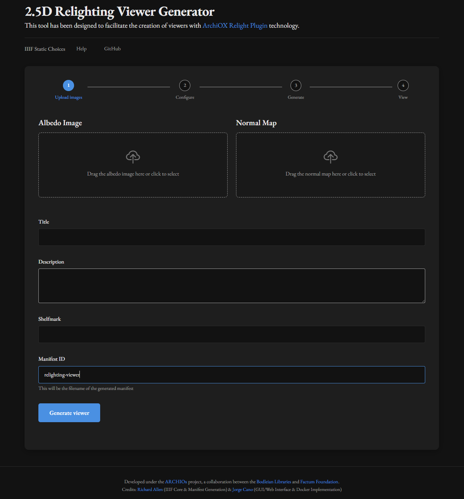

# IIIF Static Choices - Docker + GUI

This extension provides a web-based graphical interface and a Docker configuration to facilitate the creation of 2.5D relighting viewers using IIIF Static Choices.

> **Note**: This document focuses on the Docker GUI component. For complete project overview, installation options, and general usage, see the main [`README.md`](../README.md).

## What is it?

IIIF Static Choices is a tool that allows generating interactive 2.5D viewers from 2D images (albedo) and normal maps. This extension adds:

1.  **Docker Container**: Packages the entire necessary environment (Python, dependencies, web server) into a portable container that works on any operating system.
2.  **Web Interface**: Provides an intuitive graphical interface to upload images, configure metadata, and generate the viewer without needing to use commands.
3.  **Cross-Platform Compatibility**: Solves platform-specific issues (like the black screen problem on Windows) by running in a consistent Linux environment.
4.  **Multiple Viewer Management**: Supports creating and managing multiple viewers with unique resources through consistent naming conventions.

## Screenshots



## Requirements

### Image Format Requirements

- **Supported formats**: PNG (preferred) or JPG
- **Bit depth**: 8 bits per channel
- **Not supported**: TIF or other formats
- **Both images must have identical dimensions**

### Software Requirements

*   Docker
*   Docker Compose

## Usage Instructions

### Installation

1.  Clone the repository:
    ```bash
    git clone https://github.com/bodleian/iiif-static-choices.git
    cd iiif-static-choices
    ```

2.  Build and run the Docker container:
    ```bash
    docker compose -f docker-compose.main.yml up -d
    ```
    > **Note**: If this command doesn't work, try the legacy method: `docker-compose -f docker-compose.main.yml up -d`


### Usage

1.  Open your browser at http://localhost:8080
2.  Upload your albedo and normal map images
3.  Configure the viewer metadata
4.  Click on "Generate 2.5D Viewer"
5.  Open the generated link to see your 2.5D model

## Project Structure

```
docker-gui/
├── README.md              # This file
└── web-interface/
    ├── server.js          # Express web server (refactored for better organization)
    ├── package.json       # Node.js dependencies
    ├── public/            # Static files (CSS, JavaScript)
    └── views/             # EJS templates (index, help)
```

 > **Note**: The main Docker configuration files (`Dockerfile.main` and `docker-compose.main.yml`) are located in the repository root.

## Data Persistence and File Structure

Data uploaded to the web interface and generated by the application (such as IIIF tiles and manifests) is stored persistently. This is achieved using Docker volumes.

### Directory Structure

The application uses a consistent naming scheme for all files and directories:

- **Upload files**: Stored in `/app/data/uploads/`
- **Image files**: Stored as `/app/image/{id}-albedo.png` and `/app/image/{id}-normals.png`
- **Configuration**: Stored as `/app/image/{id}-config.yml`
- **Manifest file**: Generated as `/app/iiif/manifest/{id}.json`
- **Image tiles**: Generated in directories `/app/iiif/image/{id}-albedo/` and `/app/iiif/image/{id}-normals/`
- **Viewer pages**: Created in `/app/data/viewers/{id}/index.html`
- **Redirects**: Created as `/app/data/public/{id}.html`

This consistent naming structure ensures that:
- Each viewer has its own unique resources
- Multiple viewers can exist without conflicts
- All files related to a specific viewer can be easily identified

### Volume Mapping

The `docker-compose.main.yml` file configures a volume that maps the `./data` directory (located at the root of the project, alongside `docker-compose.main.yml`) on your host machine to the `/app/data` directory inside the Docker container.

This means:
- Any files the application writes to its internal `/app/data` path are actually saved in the `./data` folder on your computer.
- This data will persist even if you stop and restart the Docker containers.
- You can manage, backup, or inspect this data directly from the `./data` folder in your project directory.

## Development

### Modifying the Web Interface

The web interface is built with:
-   **Node.js** + **Express**: For the server
-   **EJS**: For templates
-   **Bootstrap**: For styles

To modify the interface, edit the files in `docker-gui/web-interface/views/`.

### Rebuilding the Container

After making changes, rebuild the container:
```bash
docker compose -f docker-compose.main.yml down
docker compose -f docker-compose.main.yml up --build -d
```

## Troubleshooting

### The container does not start

Verify that Docker is installed and running correctly. You can use these commands to diagnose problems:

```bash
# View container logs
docker compose -f docker-compose.main.yml logs

# Check container status
docker compose -f docker-compose.main.yml ps
```

### Naming issues or resource conflicts

If you experience issues where different viewers seem to be using the same resources:

1. **Check the outputId**: Ensure each viewer has a unique outputId
2. **Check server logs**: Look for any errors related to file operations
3. **Restart the container**: Sometimes a clean restart resolves file access issues

## Advanced Usage

### Verification Commands

```bash
# Check container status
docker ps | grep iiif-static-choices

# View container logs
docker logs -f iiif-static-choices-iiif-static-choices-1

# Check if services are responding
curl -s -o /dev/null -w "%{http_code}" http://localhost:8080
curl -s -o /dev/null -w "%{http_code}" http://localhost:8000
```

### Manual Commands

For advanced users who want to run generation commands manually:

```bash
# Manual tile generation
docker exec -w /app iiif-static-choices-iiif-static-choices-1 python iiif_generator.py tiles -t 256 -v 3.0

# Manual manifest generation
docker exec -w /app iiif-static-choices-iiif-static-choices-1 bash -c 'cp image/ammonite-config.yml . && python iiif_generator.py manifest -f ammonite-config.yml -o iiif/manifest/pyritised-ammonite.json -d .'
```

 > **Note**: These commands are useful for debugging or when you need more control over the generation process. For normal usage, the web interface handles all these steps automatically.
